Este texto tiene un fondo gris claro con bordes redondeados.
</div>

# Práctica 1

Un repositorio para empezar a usar [git](https://git-scm.com/) y Github


## ¿Como probar en la nube?

[Github-Codespaces](https://github.com/features/codespaces)

## Comandos git básicos

```
git clone https://github.com/gitt-3-pat/p1
git status
git add .
git commit -m "TU MENSAJE"
git push

git checkout -b feature/1
git checkout main
```

Dichos comandos se explican de manera genérica en el siguiente fichero:

[Explicación comandos](comandos.txt)


## ¿Cómo escribir un README.md con formato?

[Github Markdown](https://docs.github.com/es/get-started/writing-on-github/getting-started-with-writing-and-formatting-on-github/basic-writing-and-formatting-syntax)

### Procedimiento de la práctica
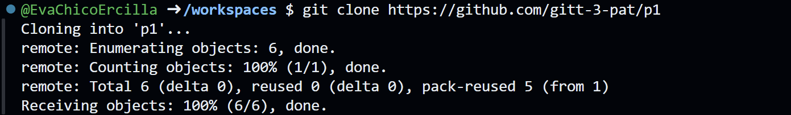
Descargamos una copia en local del repositorio indicado mediante la ruta.
Salida:
remote: Enumerating objects: 6, done --> cuenta cuántos objetos hay en total que deba descargarse. 6 en total
remote: counting objects 100% (1/1), done. --> se verifica el proceso anterior
remote: Total (delta 0), reused 0 (delta 0), pack-reused 5 (from 1) --> con delta 0 sabemos que no hubo que descargar ningun archivo calificado como complejo. Pack-reused es un método que tiene github para aumentar la eficiencia y consiste en identificar lo que queremos descargar por si ya existiera en el repositorio en remoto.
Receiving objects: 100% (6/6), done --> todos los objetos fueron descargados correctamente.


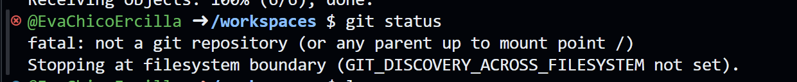
**¿Por qué no nos deja?**
porque debemos cambiar a la carpeta del repositorio
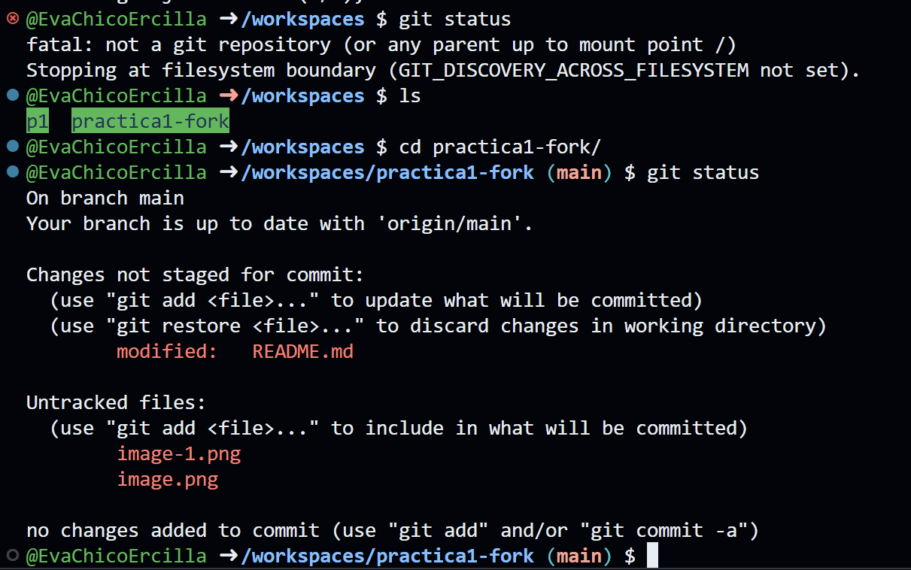
Queremos saber el estado del repositorio local
El comando git status está indicando que te encuentras en la rama main, la cual está sincronizada con el repositorio remoto (origin/main). Tienes cambios no preparados para el commit en el archivo README.md (marcado como "modified"), y también tienes dos archivos nuevos (image-1.png y image.png) que no están siendo rastreados por Git ("untracked files"). Ninguno de estos cambios ha sido añadido al índice (staging area), por lo que no están listos para ser confirmados (commit). Git también te sugiere comandos (git add o git restore) para gestionar estos cambios.


lo que consigue este comando es mandar todos los archivos (por el '.') del directorio actual al staging area. Esto es que se confirman los cambios para el próximo commit


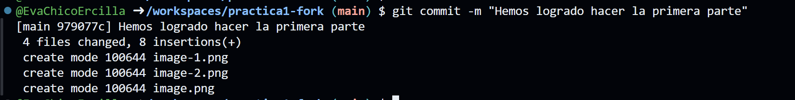

Se modificaron 4 archivos en total.
Hubo 8 líneas agregadas en esos archivos (no se eliminaron líneas).

100644 es el permiso predeterminado que indica que son archivos regulares sin permisos de ejecución.
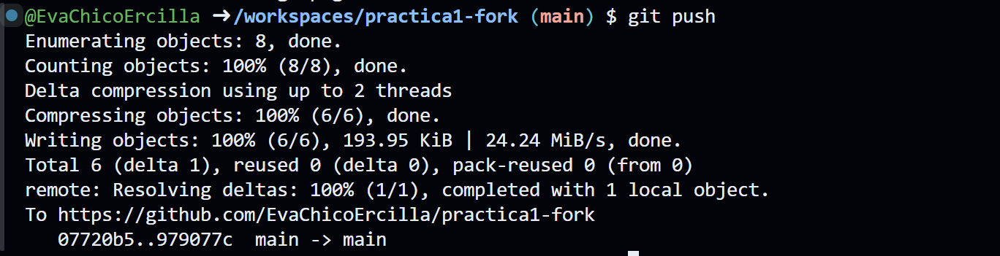

Aquí tienes una explicación línea por línea de la salida del comando git push:

1. **Enumerating objects: 8, done.**  
   - Git identificó un total de 8 objetos (commits, blobs, árboles) que deben ser enviados al repositorio remoto.

2. **Counting objects: 100% (8/8), done.**  
   - Git verificó que todos los objetos identificados (los 8) están listos para ser enviados.

3. **Delta compression using up to 2 threads**  
   - Git utilizó compresión *delta* para optimizar la transferencia, empleando hasta 2 hilos de procesamiento.

4. **Compressing objects: 100% (6/6), done.**  
   - Se comprimieron 6 objetos para reducir el tamaño de los datos transferidos.

5. **Writing objects: 100% (6/6), 193.95 KiB | 24.24 MiB/s, done.**  
   - Git escribió 6 objetos comprimidos en el repositorio remoto, ocupando un total de 193.95 KiB.

6. **Total 6 (delta 1), reused 0 (delta 0), pack-reused 0 (from 0)**  
   - En el remoto:  
     - 6 objetos se transfirieron, 1 de ellos como *delta* (diferencia).  
     - No se reutilizaron objetos ya existentes.

7. **remote: Resolving deltas: 100% (1/1), completed with 1 local object.**  
   - El repositorio remoto aplicó correctamente 1 *delta* y procesó 1 objeto local.

8. **To https://github.com/EvaChicoErcilla/practica1-fork**  
   - Los cambios se enviaron al repositorio remoto en la URL especificada.

9. **07720b5..979077c  main -> main**  
   - La rama local main (con el último commit 979077c) se sincronizó con la rama remota main (previamente en el commit 07720b5).

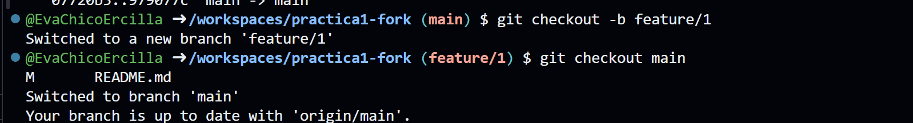
1. git checkout -b feature/1
   Salida: Switched to a new branch 'feature/1'  
   Explicación: Crea una nueva rama llamada feature/1 y automáticamente cambia a ella.

2. git checkout main 
   Salida: M README.md  
   Explicación: Antes de cambiar a la rama main, Git detecta que el archivo README.md fue modificado en la rama actual (feature/1).

3. Salida: Switched to branch main  
   Explicación: Cambia a la rama main.

4. Salida: Your branch is up to date with 'origin/main'.  
   Explicación: La rama main está sincronizada con el repositorio remoto en su última versión.

   # INSTALACIÓN PROGRAMAS PEDIDOS
   ## Java 17
   enlace: https://download.oracle.com/java/17/archive/jdk-17.0.12_windows-x64_bin.exe
   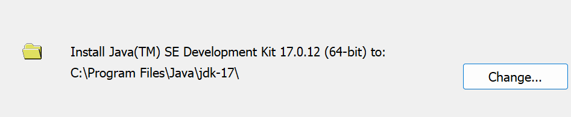
   link para saber usarlo: https://docs.oracle.com/en/java/javase/17/index.html
   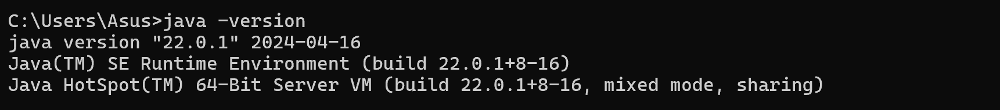

   ##  Maven
   enlace: apache-maven-3.9.9-bin.zip
   C:\Users\Asus\Downloads\apache-maven-3.9.9-bin (1)
   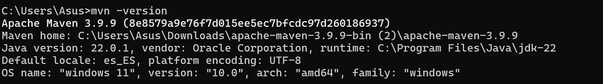
   

   ## UTILIZANDO LOS RECURSOS
   La idea de tener estos tres recursos instalados es que trabajaremos desde IntelliJ IDEA, pero el ordenador necesita tener JAVA para poder entender los comandos. Además, usaremos MAVEN para organizar nuestro código y crear archivos de extensión .jar si lo necesitamos.

   Para aprender a manejar IntelliJ IDEA, nos apoyaremos en la siguiente página web: 
   https://www.jetbrains.com/help/idea/creating-and-running-your-first-java-application.html

   Primera prueba: hacemos un print
   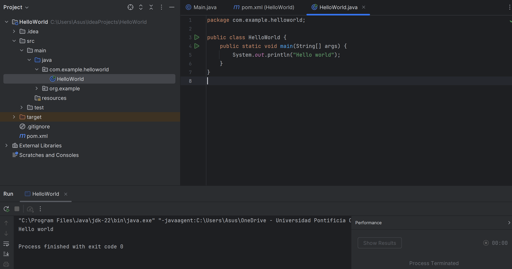

   Usamos Maven para crear un archivo de extensión .jar
   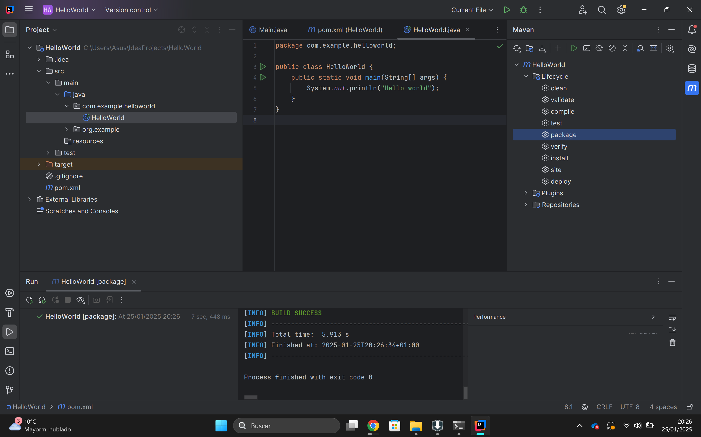
   Y ahora buscamos en la terminal del ordenador el archivo creado
   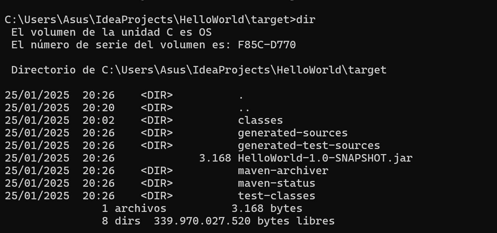